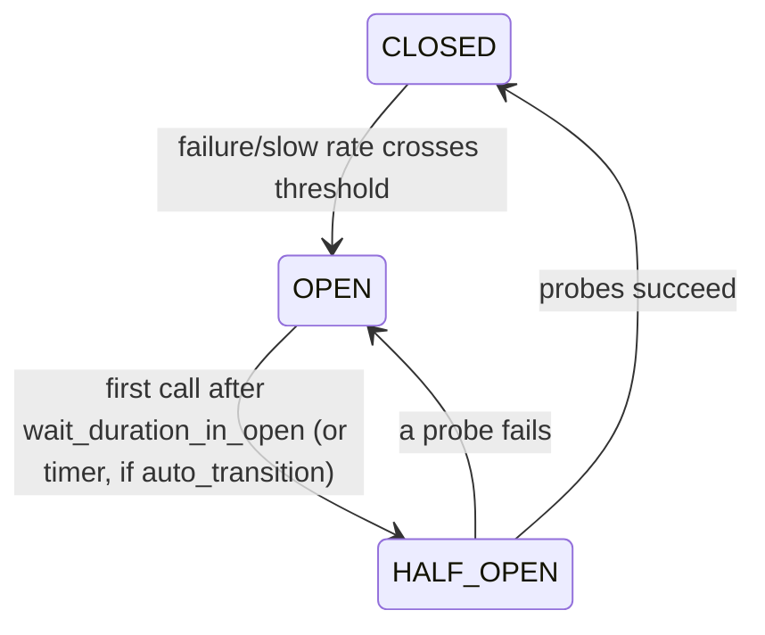

# States & manual control

A breaker has three core states plus three operator overrides.

## Core lifecycle



- **`CLOSED`** — traffic flows; outcomes are recorded. When the failure rate (or
  slow-call rate) crosses its threshold over at least `minimum_number_of_calls`,
  the breaker trips to `OPEN`.
- **`OPEN`** — calls are rejected immediately with `CircuitOpenError`. After
  `wait_duration_in_open` seconds, the **next** call lazily moves the breaker to
  `HALF_OPEN`. Enable [`auto_transition`](#proactive-transition-auto_transition)
  to have a timer make that move on its own.
- **`HALF_OPEN`** — a limited number of probe calls are admitted, with a cap on
  how many run concurrently, so a barely-recovered dependency is not hit by the
  full parallel load at once. Probes succeeding closes the breaker; a probe
  failing re-opens it.

## Proactive transition (`auto_transition`)

By default the `OPEN → HALF_OPEN` move is **lazy**: it happens on the first call
after `wait_duration_in_open` elapses. A low-traffic service can therefore sit in
`OPEN` longer than necessary, and — since nothing changes until that call — the
state-change event is not emitted, leaving a blind spot on dashboards.

Set `auto_transition=True` to arm a timer that performs the move on its own when
the wait elapses, emitting `on_state_change` without waiting for a call:

```python
from interlock import CircuitBreaker, Config

breaker = CircuitBreaker(
    name='payments',
    config=Config(wait_duration_in_open=30.0, auto_transition=True),
)
# 30s after opening, the breaker moves to HALF_OPEN and emits the event,
# even if no call arrives.
```

The lazy path stays authoritative: the timer only flips the state (it admits no
probe), so the first real call still becomes the first probe. If a call arrives
exactly as the timer fires, a lock ensures the transition and its event happen
exactly once. The timer is cancelled automatically on `reset()`, `force_open()`,
or when a call makes the move first.

The timer is a daemon thread, used uniformly for sync and async breakers (the
breaker's critical sections are guarded by a `threading.Lock`, never an event
loop), so a pending timer never blocks interpreter shutdown.

## Operator overrides

Three special states are set manually and stay until you `reset()`:

| Method | State | Behaviour |
|--------|-------|-----------|
| `breaker.force_open()` | `FORCED_OPEN` | Reject all traffic regardless of metrics. |
| `breaker.disable()` | `DISABLED` | Admit all traffic, record nothing — the breaker is a no-op. |
| `breaker.metrics_only()` | `METRICS_ONLY` | Admit all traffic, record metrics, but never trip. |
| `breaker.reset()` | `CLOSED` | Return to closed with a fresh, empty window. |

```python
breaker.metrics_only()   # observe in production without enforcing
# ... inspect breaker.snapshot() until thresholds look right ...
breaker.reset()          # start enforcing with a clean window
```

### `METRICS_ONLY` — safe rollout

Shadow mode is the key to introducing a breaker without risk: it records the
exact failure and slow-call rates real traffic produces, so you can tune
thresholds against live data before letting the breaker reject anything. It
costs almost nothing to leave on.

## Observing transitions

Every transition (and reset) is delivered to the breaker's
[`EventListener`](observability.md), so you can log or export state changes
without polling `breaker.state`.
