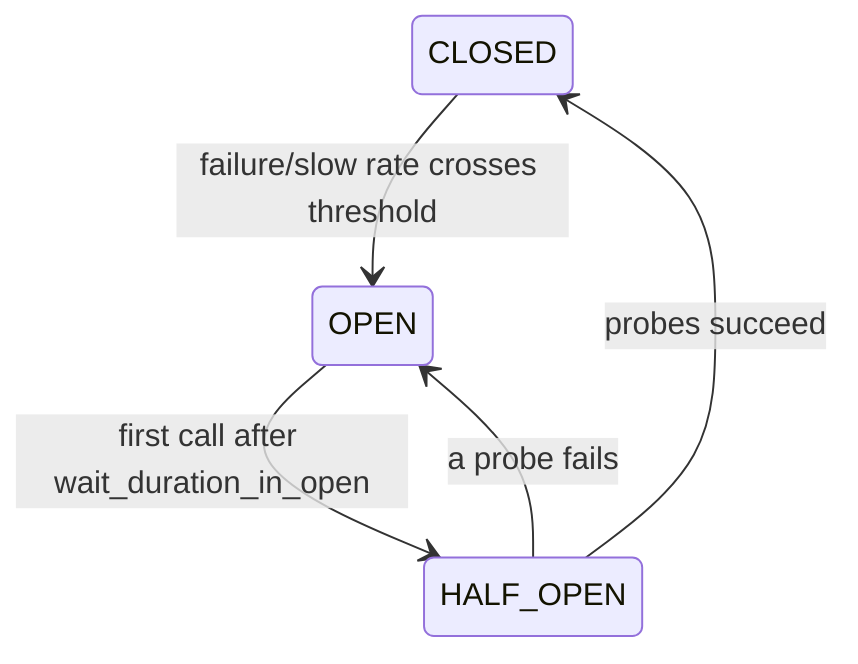

# States & manual control

A breaker has three core states plus three operator overrides.

## Core lifecycle



- **`CLOSED`** — traffic flows; outcomes are recorded. When the failure rate (or
  slow-call rate) crosses its threshold over at least `minimum_number_of_calls`,
  the breaker trips to `OPEN`.
- **`OPEN`** — calls are rejected immediately with `CircuitOpenError`. After
  `wait_duration_in_open` seconds, the **next** call lazily moves the breaker to
  `HALF_OPEN` (there is no background timer in v1.0).
- **`HALF_OPEN`** — a limited number of probe calls are admitted, with a cap on
  how many run concurrently, so a barely-recovered dependency is not hit by the
  full parallel load at once. Probes succeeding closes the breaker; a probe
  failing re-opens it.

## Operator overrides

Three special states are set manually and stay until you `reset()`:

| Method | State | Behaviour |
|--------|-------|-----------|
| `breaker.force_open()` | `FORCED_OPEN` | Reject all traffic regardless of metrics. |
| `breaker.disable()` | `DISABLED` | Admit all traffic, record nothing — the breaker is a no-op. |
| `breaker.metrics_only()` | `METRICS_ONLY` | Admit all traffic, record metrics, but never trip. |
| `breaker.reset()` | `CLOSED` | Return to closed with a fresh, empty window. |

```python
breaker.metrics_only()   # observe in production without enforcing
# ... inspect breaker.snapshot() until thresholds look right ...
breaker.reset()          # start enforcing with a clean window
```

### `METRICS_ONLY` — safe rollout

Shadow mode is the key to introducing a breaker without risk: it records the
exact failure and slow-call rates real traffic produces, so you can tune
thresholds against live data before letting the breaker reject anything. It
costs almost nothing to leave on.

## Observing transitions

Every transition (and reset) is delivered to the breaker's
[`EventListener`](observability.md), so you can log or export state changes
without polling `breaker.state`.
