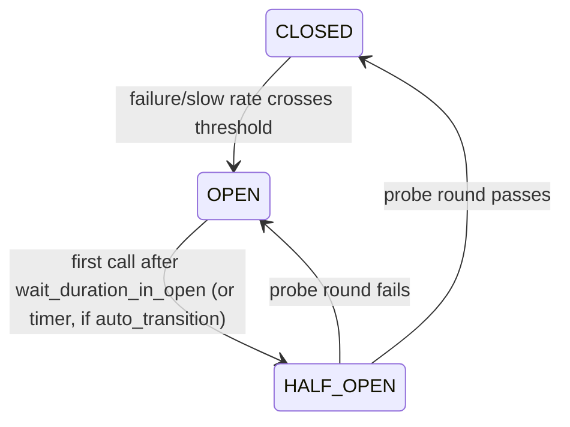

# States & manual control

A breaker has three core states plus three operator overrides.

## Core lifecycle


```mermaid
stateDiagram-v2
    CLOSED --> OPEN: failure/slow rate crosses threshold
    OPEN --> HALF_OPEN: first call after wait_duration_in_open (or timer, if auto_transition)
    HALF_OPEN --> CLOSED: probe round passes
    HALF_OPEN --> OPEN: probe round fails
```

- **`CLOSED`** — traffic flows; outcomes are recorded. When the failure rate (or
  slow-call rate) crosses its threshold over at least `minimum_number_of_calls`,
  the breaker trips to `OPEN`.
- **`OPEN`** — calls are rejected immediately with `CircuitOpenError`. After
  `wait_duration_in_open` seconds, the **next** call lazily moves the breaker to
  `HALF_OPEN`. Enable [`auto_transition`](#proactive-transition-auto_transition)
  to have a timer make that move on its own.
- **`HALF_OPEN`** — up to `permitted_calls_in_half_open` probe calls are
  admitted, with a cap on how many run concurrently, so a barely-recovered
  dependency is not hit by the full parallel load at once. Once the round
  completes, the breaker decides from the probes' outcomes using the same
  thresholds as `CLOSED`: rates below the thresholds close it, at or above
  re-open it. Calls beyond the probe caps are rejected while the round runs.

## When a probe cannot reach the dependency

A probe asks one question: has the dependency recovered? Some failures cannot
answer it, because the call never left the process — no free connection in the
local pool, no bulkhead permit. Counting one as a probe failure re-opens the
breaker on evidence it does not have, and if the local cause outlives the outage
that opened the breaker, every round fails the same way and the breaker never
closes again.

Integrations mark those failures for you. The httpx and httpx2 transports treat
`PoolTimeout` this way: in `HALF_OPEN` the probe hands its slot back without a
verdict, and the round continues. `CLOSED` is untouched — there an exhausted
pool usually *is* the dependency holding connections open, and shedding load is
exactly what should happen.

A round still has to end. Once as many probes have come back inconclusive as the
round permits, the breaker re-opens: nothing was learned, so waiting is the only
honest move left.

Other guards pass their own set:

```python
from interlock import CircuitBreaker, Registry


class NoLocalSlot(Exception):
    """Raised by the guard's own pool when it has no permit to give out."""


breaker = CircuitBreaker(name='payments', unreachable_exceptions=(NoLocalSlot,))
registry = Registry(unreachable_exceptions=(NoLocalSlot,))
```

## Backing off between probe rounds

`wait_duration_in_open` is constant by default: a breaker that cannot recover
retries at exactly the same rate forever, hammering a dependency that is already
in trouble. Set `wait_duration_backoff_multiplier` above `1.0` to lengthen the
wait after each consecutive failed round, and `wait_duration_in_open_max` to cap
it. A round that passes resets both.

```python
from interlock import CircuitBreaker, Config

breaker = CircuitBreaker(
    name='payments',
    config=Config(
        wait_duration_in_open=5.0,
        wait_duration_backoff_multiplier=2.0,
        wait_duration_in_open_max=120.0,
    ),
)
# Failed rounds wait 5s, then 10s, 20s, 40s… up to 120s.
```

The growing interval is also a signal in its own right: a breaker waiting out a
blip looks nothing like one that has failed ten rounds in a row.

The backoff is local. Under a shared [storage](../integrations/redis.md) the
coordinated lane reopens on `wait_duration_in_open` and keeps no failed-round
count, so a coordinated breaker retries on the base wait no matter how many
rounds have failed.

Growth stops after 64 consecutive failed rounds. Any sane multiplier has long
since passed `wait_duration_in_open_max` by then, and an unbounded exponent
would eventually overflow to an infinite wait that never elapses — leaving the
breaker open for good, which is precisely the failure this release set out to
remove.

## Proactive transition (`auto_transition`)

By default the `OPEN → HALF_OPEN` move is **lazy**: it happens on the first call
after `wait_duration_in_open` elapses. A low-traffic service can therefore sit in
`OPEN` longer than necessary, and — since nothing changes until that call — the
state-change event is not emitted, leaving a blind spot on dashboards.

Set `auto_transition=True` to arm a timer that performs the move on its own when
the wait elapses, emitting `on_state_change` without waiting for a call:

```python
from interlock import CircuitBreaker, Config

breaker = CircuitBreaker(
    name='payments',
    config=Config(wait_duration_in_open=30.0, auto_transition=True),
)
# 30s after opening, the breaker moves to HALF_OPEN and emits the event,
# even if no call arrives.
```

The lazy path stays authoritative: the timer only flips the state (it admits no
probe), so the first real call still becomes the first probe. If a call arrives
exactly as the timer fires, a lock ensures the transition and its event happen
exactly once. The timer is cancelled automatically on `reset()`, `force_open()`,
or when a call makes the move first.

The timer is a daemon thread, used uniformly for sync and async breakers (the
breaker's critical sections are guarded by a `threading.Lock`, never an event
loop), so a pending timer never blocks interpreter shutdown.

## Operator overrides

Three special states are set manually and stay until you `reset()`:

| Method | State | Behaviour |
|--------|-------|-----------|
| `breaker.force_open()` | `FORCED_OPEN` | Reject all traffic regardless of metrics. |
| `breaker.disable()` | `DISABLED` | Admit all traffic but record no outcome — thresholds are never evaluated and `snapshot()` gets nothing new. Listener `on_call` events still fire. |
| `breaker.metrics_only()` | `METRICS_ONLY` | Admit all traffic, record metrics, but never trip. |
| `breaker.reset()` | `CLOSED` | Return to closed with a fresh, empty window. In coordinated mode, resume the cached shared state instead. |

```python
breaker.metrics_only()  # observe in production without enforcing
# ... inspect breaker.snapshot() until thresholds look right ...
breaker.reset()  # start enforcing with a clean window
```

### What an override does to your metrics

Two observability surfaces are in play, and an override does not move them
together:

- the sliding **window** — what `snapshot()` reports and what the thresholds
  read. `METRICS_ONLY` keeps filling it (that is the whole point of shadow
  mode); `DISABLED` records nothing and `FORCED_OPEN` admits nothing to record,
  so neither feeds it. A count-based window then keeps its last contents
  unchanged; a time-based one drains as its buckets expire;
- the **`EventListener`**, which observes calls rather than the window.
  `on_call` fires whenever an admitted call settles, whatever the state —
  `DISABLED` included; `on_rejected` fires for every rejected call,
  `FORCED_OPEN` included.

So `disable()` is not a way to silence a listener: `LoggingEventListener`, the
`OTelEventListener` or a Prometheus exporter keeps reporting outcomes and
durations for a disabled breaker, with the classifier still deciding success
from failure. That is deliberate — dashboards going dark the moment an operator
disables a breaker looks exactly like an outage. To stop the events, drop the
listener instead (construct the breaker without one).

Switching a rollout from `metrics_only()` to `disable()` therefore keeps
listener-exported dashboards alive, and only stops threshold evaluation and
`snapshot()`.

### Safe rollout

Shadow mode is the key to introducing a breaker without risk: it records the
exact failure and slow-call rates real traffic produces, so you can tune
thresholds against live data before letting the breaker reject anything. It
costs almost nothing to leave on.

Set the mode at construction when no call may be admitted first:

```python
from interlock import CircuitBreaker, Registry, State

breaker = CircuitBreaker(name='payments', initial_state=State.METRICS_ONLY)
registry = Registry(initial_state=State.METRICS_ONLY)
```

`Registry` applies the state while holding its creation lock and publishes the
breaker only afterwards. Every name created later therefore starts in shadow
mode too. Construction is not a state transition, so it does not emit a
synthetic `CLOSED → METRICS_ONLY` listener event.

Only stable states are valid at construction: `CLOSED`, `FORCED_OPEN`,
`DISABLED` and `METRICS_ONLY`. `OPEN` and `HALF_OPEN` require timing, probe and
failure history, so passing either as `initial_state` raises `ValueError`.

For a production rollout:

1. Deploy with `initial_state=State.METRICS_ONLY` and an `EventListener` that
   exports call outcomes.
2. Observe failure and slow-call rates, then tune `Config` against real traffic.
3. Deploy a new breaker, registry or transport with `initial_state=State.CLOSED`
   (the default). The enforcing instance starts with a fresh window.

Prefer a new deployment for step 3. Calling `reset()` enforces immediately for
an existing breaker, but a registry configured with `METRICS_ONLY` would still
apply that original initial state to hosts first seen later.

For local diagnosis, `registry.get_existing(name)` returns a cached breaker or
`None` without creating one. Inspect its `state` and `snapshot()`; use listeners
rather than polling snapshots for production metrics.

When the names are not known in advance — the HTTP transports create one
breaker per host, lazily — `registry.items()` lists every breaker created so
far, and `registry.names()` just their names. Both return a point-in-time copy,
so they also drive bulk operator actions:

```python
for _, breaker in registry.items():
    breaker.metrics_only()
```

## Coordinated state (optional)

With a shared [storage](../integrations/redis.md), `OPEN` and `HALF_OPEN` can
also be *adopted* from other instances: a trip anywhere in the fleet gates
admission everywhere, and the HALF_OPEN probe budget is shared globally.
`breaker.state` then reports the effective state — the shared one when it
governs admission, the local one otherwise (including while the storage is
unreachable).

Local operator overrides always take precedence over a healthy shared view:
`force_open()` rejects locally, while `disable()` and `metrics_only()` admit
locally without claiming a shared HALF_OPEN probe. `reset()` clears that local
override and freshens local metrics; it does not change the cluster. The
instance immediately resumes the cached shared `OPEN` or `HALF_OPEN` state.

## Observing transitions

Every transition (and reset) is delivered to the breaker's
[`EventListener`](observability.md), so you can log or export state changes
without polling `breaker.state`.
